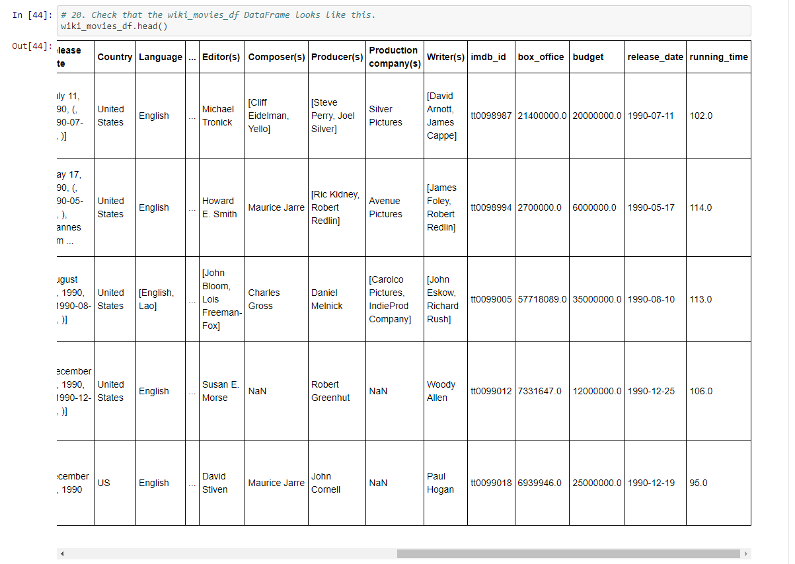

# Overview
Columbia Data Science Module 8

In this module, I created an ETL function to read three disparate data files containing movie data. I then extracted and transformed the data from Wikipedia and Kaggle before creating a database in PGAdmin. 

Please note: I tried to upload the .csv files to the resources folder, but even when compressed, they were too large for Github to accept. 

## Tools

Software: Jupyter Notebook, Python, PostgreSQL, SQL, 

Python packages: json, pandas, numpy, re, sqlalchemy, time

Data: movies_metadata.csv and ratings.csv from [Kaggle](https://www.kaggle.com/rounakbanik/the-movies-dataset?select=ratings.csv), [wikipedia-movies.json](https://github.com/perryabdulkadir/Movies-ETL/blob/main/Resources/wikipedia-movies.json)


## Analysis

### Writing an ETL Function to Read Three Data Files

I started in [ETL_function_test.ipynb](https://github.com/perryabdulkadir/Movies-ETL/blob/main/ETL_function_test.ipynb), writing a function that takes three arguments. It loads in the two .csv files (movies_metadata.csv and ratings.csv) and the JSON file (wikipedia-movies.json) and turns them all into data frames (kaggle_metadata, ratings, and wiki_movies_df).

```
def extract_transform_load(wikidata, ratings, movielens):
    # 2. Read in the kaggle metadata and MovieLens ratings CSV files as Pandas DataFrames.
    kaggle_metadata = pd.read_csv(movielens)
    ratings = pd.read_csv(ratings)

    # 3. Open the read the Wikipedia data JSON file.
    with open(wikidata, mode='r') as file:
        wiki_movies_raw = json.load(file)
    # 4. Read in the raw wiki movie data as a Pandas DataFrame.
    wiki_movies_df =  pd.DataFrame(wiki_movies_raw)
    # 5. Return the three DataFrames
    return wiki_movies_df, kaggle_metadata, ratings
   ```
   
  I made variables representing file directories for each of the data sources. 
  
  ```
  file_dir = 'C:/Users/Perry/Movies-ETL' 
# Wikipedia data
wiki_file = f'{file_dir}/wikipedia-movies.json'
# Kaggle metadata
kaggle_file = f'{file_dir}/movies_metadata.csv'
# MovieLens rating data.
ratings_file = f'{file_dir}/ratings.csv'
```

Then, I set the file directory variables equal to the extract_transform_load function. 

```
wiki_file, kaggle_file, ratings_file = extract_transform_load(wiki_file, ratings_file, kaggle_file)
```
Next, I set the data fames equal to the file variables. 

```
wiki_movies_df = wiki_file
kaggle_metadata = kaggle_file
ratings = ratings_file
```
I checked each data frame to verify it had been properly populated. 

* **wiki_movies_df**


* **kaggle_metadata_df**


* **ratings**


## Extracting and Transforming the Wikipedia Data
Unfortunately, due to numerous issues of inconsistent formatting, it was necessary to clean and transform the Wikipedia data before I could proceed with analysis. I began coding in a new notebook, [ETL_clean_wiki_movies.ipynb](https://github.com/perryabdulkadir/Movies-ETL/blob/main/ETL_clean_wiki_movies.ipynb).

The clean_movie function takes the argument 'movie' and combines alternate titles into one list, then combines synonymous words and phrases (e.g. 'Directed by' and 'Director'). 


I then began constructing a function, also called extract_transform_load, that takes in the arguments wikidata, ratings, and movielens. The first section of the function reads in the JSON and CSV files as data frames. A list comprehension removes TV shows from the Wikipedia data by removing entries that have 'No. of episodes' in them. Another list comprehension iterates through the wiki_movies list and applies the clean_movie function to each movie. Then, the resulting clean_movies list is turned into a data frame, wiki_movies_df. 


Next, a try-except block iterates through the wiki_movies_df column imdb_link using a regex expression to extract the IMDB ID from the link. These IMDB IDs are then added as their own cloumn to wiki_movies_df. If the regex expression fails, the line that threw the error is printed. The next section of code specifies that columns should be dropped if more than 10% of rows contain null values. A new variable, box_office, is then created to hold non-null values from the Box office column. In order to properly use regular expressions to clean the box office numbers, lambda and join functions are used to convert the box office data to string values. Regex expressions are then used to create separate lists for the two different kinds of box office number formats: form_one and form_two. The parse_dollars function then takes each box office string and converts it to float. If it cannot parse the string, it returns null.


The next portion of code passes the Box office column of wiki_movies_df through the parse_dollars function. It also applies the parse_dollars function to the Budget column after a few regex expressions to change the format of Budget column entries.


The last portion of this code block cleans the release date column by applying regex expression to regularize four common forms of dates, then uses the Pandas to_datetime function to change the data type to datetime. More regex and lambda expressions are used to standardize the running time column.


The same method of setting data file directory variables equal to the ETL function is used from the 'Writing an ETL Function to Read Three Data Files' section. Checking the cleaned wiki_movies_df confirms that the cleaning was successful. 




### Extracting and Transforming the Kaggle Data

Luckily, the transformation required for the Kaggle dataset was similar to the transformation of the Wikipedia dataset, so simply refactoring the previous code accomplished most of the necessary transformation. I reused/refactored the clean_movie, change_column_name, extract_transform_load, and parse_dollars function. However, some new code had to be written. Various things were done to clean the Kaggle data, such as setting the budget column to be an integer datatype. Next, the wiki_movies_df and kaggle_metada were merged into one data frame, movies_df. Several irrelevant columns were dropped from this new frame. After that, the function fill_missing_kaggle_data was written using a lambda expression to fill null values in the Kaggle data with '0' where appropriate. Then, a loc filter was applied to retain only relevant remaining columns, and the columns were renamed to be more descriptive and consistent. Finally, the movies_with_ratings_df was created by merging rating_counts and movies_df.


movies_with_ratings_df was successfully populated. 


### Creating the Movie Database

The final step of the project was to add the movies_df and MovieLens rating CSV to a SQL database. The notebook [ETL_create_database.ipynb contains the code](https://github.com/perryabdulkadir/Movies-ETL/blob/main/ETL_create_database.ipynb) to do this. 


The data was successfully imported into SQL. A query returned a count of 6075 in the movies table:


Another query returned a count of 26024289 in the movies table:


## Summary
I successfully created a PostgreSQL database of movie information after extracting data from three disparate sources, then cleaning and transforming it.


### **Contact:**

**Email:** perry.abdulkadir@alumni.harvard.edu

**Linkedin:** https://www.linkedin.com/in/perry-abdulkadir-6a255199/

